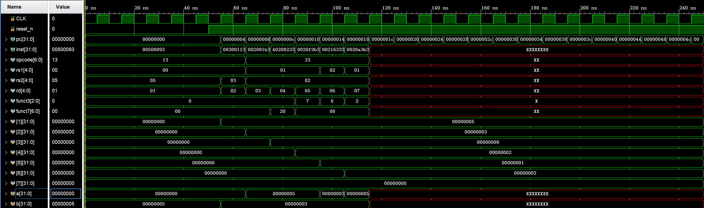

# RISC-V 单周期处理器

## 概述

本项目实现了一个基于 RV32I 基础整数指令集的单周期 RISC-V 处理器核心，纯 Verilog 实现。支持 32 位地址空间、32 位数据通路，已完成仿真验证。

## 文件列表

- LICENSE：MIT 许可证
- README.md：项目说明
- alu.v：算术逻辑单元
- control.v：控制单元
- decoder.v：指令译码器
- dmem.v：数据存储器
- imem.v：指令存储器
- pc.v：程序计数器
- program.hex.txt：测试程序机器码
- regfile.v：寄存器堆
- riscv_single_cycle_waveform.png：仿真波形截图
- top.v：顶层模块
- top_tb.v：仿真测试文件

## 支持指令

R 型：add, sub, and, or, slt
I 型：addi, andi, ori, slti, lw
S 型：sw
B 型：beq, bne
J 型：jal, jalr
U 型：lui

## 测试程序

1. addi x1, x0, 5 → x1 = 5
2. addi x2, x0, 3 → x2 = 3
3. add x3, x1, x2 → x3 = 8
4. sub x4, x1, x2 → x4 = 2
5. and x5, x1, x2 → x5 = 1
6. or x6, x2, x2 → x6 = 3
7. slt x7, x1, x2 → x7 = 0

## 仿真结果

## 使用方法

仿真工具：Vivado，时钟频率 100MHz。将所有 .v 文件添加到工程，将 top_tb.v 设为顶层，确保 program.hex.txt 路径正确，运行仿真。

## 许可证

MIT License
